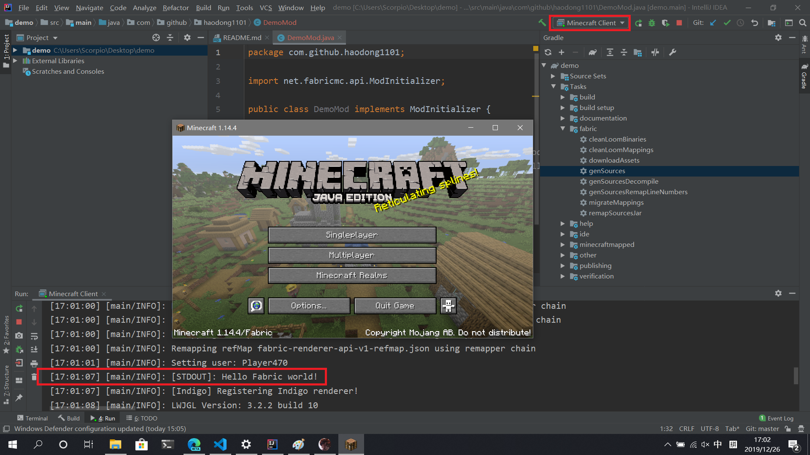

# 第一章 开发环境
- ## 安装 [jdk](https://www.oracle.com/technetwork/java/javase/downloads/index.html)（8或以上版本）
- ## 安装 [IntelliJ IDEA](https://www.jetbrains.com/idea/download/#section=windows) （Community版本可以免费使用）
- ## 下载 [fabric-mod-example](https://github.com/FabricMC/fabric-example-mod/) 到本地
- ## 修改 gradle.properties 文件
  1. ### mod_version = 1.0.0（版本号）
  2. ### maven_group = com.github.haodong1101 (包名)
  3. ### archives_base_name = demo (模组名)
  4. ### 通过[这个网站](https://modmuss50.me/fabric.html?&version=1.14.4)修改 minecraft_version、yarn_mappings、loader_version、fabric_version 的参数信息
       
- ## 修改 项目文件
   1. ### 修改文件路径名为自己的包名（src\main\java\net\fabricmc\example -> src\main\java\com\github\haodong1101）
   2. ### 修改模组主文件名为自己的模组名（ExampleMod.java -> DemoMod.java）
   3. ### 改正模组主文件中的包名和类名
       
   4. ### 修改资源文件路径名（src\main\resources\assets\modid -> src\main\resources\assets\demo）
- ## 修改 src\main\resources\fabric.mod.json 文件
   1. ### "id" 模组ID
   2. ### "name"   模组名
   3. ### "description"   描述
   4. ### "icon"  模组图标
   5. ### "entrypoints":"main"  模组主文件地址
   6. ### "depends":"minecraft"  minecraft版本
       
- ## 构建Gradle项目
   1. ### 进入项目根目录，选择资源管理器的菜单：文件-> 打开Windows PowerShell
   2. ### 命令行中输入 
            .\gradlew idea
   3. ### 等待命令完成 （中国大陆由于众所周知的原因，此命令可能较慢或者失败，请多次尝试，或使用代理）
       
   4. ### 当出现绿色 BUILD SUCCESSFUL 字样时，表示构建成功，然后打开文件夹中的 .ipr 文件
       
   5. ### 打开后，选择右下角的 Import Gradle Project 等待idea自动构建完成
       
   6. ### 右侧 Gradle 标签页，执行 genSource 任务
       
      ### 等待执行成功
       
   7. ### 配置运行项
       
      ### Use ClassPath of Module选择带 .main后缀的项目 （同时设置Minecraft Client和Minecraft Server）  
       
   8. ### 现在就已经可以正常运行Minecraft了
       
