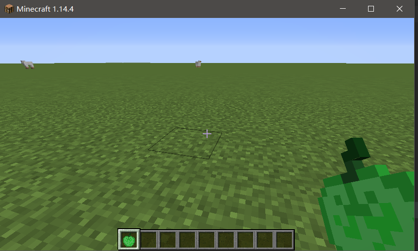
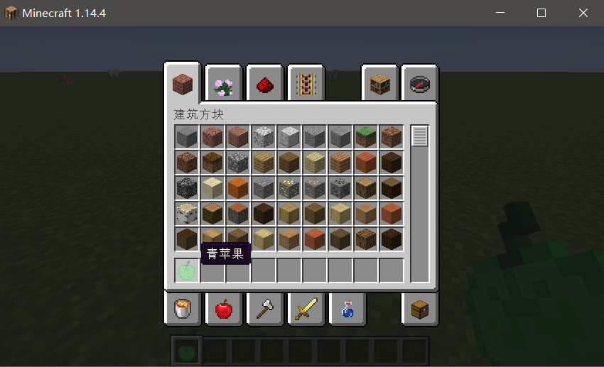
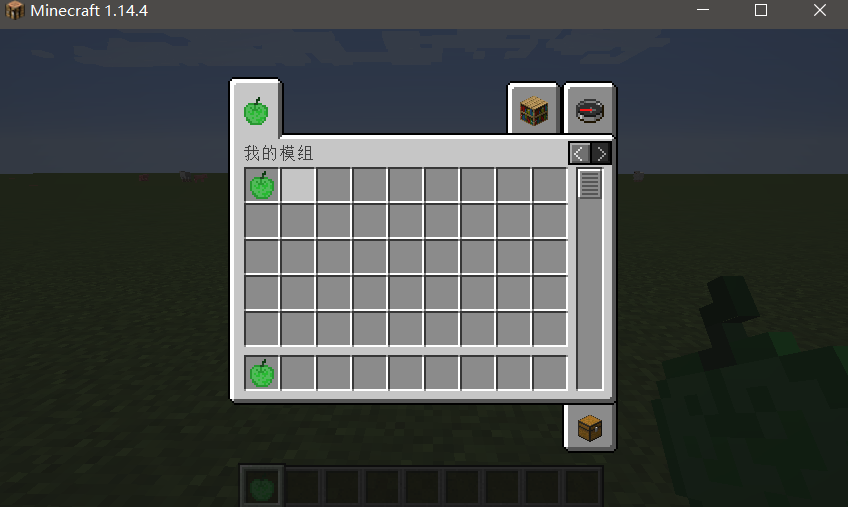

# 第一个物品

- 创建第一个物品

  - 在模组主文件类中实例化一个新的Item类型对象，实例化时需要传入一个Settings类型参数。Settings参数可以设置物品的基本属性，比如物品堆叠数量，所属创造物品栏等。
    - `public static final Item GREEN_APPLE_ITEM = new Item(new Item.Settings());`
  - 在`onInitialize()`方法中，注册我们的物品，使用`Registry.register()`进行注册。该方法有三个参数，第一个是注册的类型，第二个是`Identifier`类型参数，第三个是物品对象。
    - `Identifier`类有两个参数，模组ID，物品ID
    - `Registry.register(Registry.ITEM,new Identifier("demo","green_apple_item"),GREEN_APPLE_ITEM);`

  - 进入游戏，输入`give 玩家名 模组ID:物品名` 将会得到我们的第一个物品——一个紫黑色的方块。

- 给物品添加模型

  - 在 `resources\assets\modid`文件夹下新建`models`和`textures`文件夹，在这两个文件夹下分别新建item文件夹。

  - 将模型图片`green_apple_item.png`加入到`textures\item`文件夹下，名称与物品名称相同。

  - 在models\item文件夹下新建模组id为名的`json`文件，`green_apple_item.json`。

  - 文件内添加以下代码：

    ~~~JavaScript
    {
        "parent": "item/generated",//正常手持时的模型
        "textures": {
            "layer0": "demo:item/green_apple_item"
            //layer0为模型位置
        }
    }
    
    ~~~

  - 运行游戏，即可看到模型已经设置成功

    

- 给物品添加语言翻译·

  - 在 `resources\assets\modid`文件夹下新建`lang`文件夹,文件夹内新建`en_us.json`和`zh_cn.json`文件，分别是英文和中文的翻译文件，其他语言可添加相应翻译文件。

  - 在翻译文件内添加如下代码

    ~~~JavaScript
    {//zh_cn.json
      "item.demo.green_apple_item": "青苹果"
    }
    {//en_us.json
      "item.demo.green_apple_item": "Green Apple"
    }
    //格式 "item.模组ID.物品ID":"对应翻译"
    ~~~

  - 运行游戏，翻译已生效。

    

- 添加自定义创造标签栏

  - 使用`FabricItemGroupBuilder` 来添加创造标签栏，一旦`FabricItemGroupBuilder.build()`被调用，该标签栏就将添加在创造栏的列表中

    ~~~java
    //静态创建
    public static final ItemGroup DEMO_GROUP = FabricItemGroupBuilder.build(
                new Identifier("demo", "demo_group"),
                () -> new ItemStack(INSTANCE.GREEN_APPLE_ITEM)); //图标物品
    //动态创建
  public static final ItemGroup DEMO_GROUP = FabricItemGroupBuilder.create(
                new Identifier("demo", "demo_group"))
              .icon(() -> new ItemStack(GREEN_APPLE_ITEM))
                .build();
  ~~~
  
  - 添加物品到创造标签栏
  
  - 第一种方式： 物品对象实例化时，设置传入的Settings参数：
  
    ~~~java
      //静态创建物品栏时
      public static final Item YOUR_ITEM = new Item(new Item.Settings().itemGroup(ExampleMod.ITEM_GROUP));
      ~~~
  
    - 第二种方式：标签栏声明时：
  
      ~~~java
      //动态创建物品栏时
      public static final ItemGroup DEMO_GROUP = FabricItemGroupBuilder.create(
        new Identifier("demo", "demo_group"))
          .icon(() -> new ItemStack(GREEN_APPLE_ITEM))
        .appendItems(stacks->{
              stacks.add(new ItemStack(GREEN_APPLE_ITEM));
          })
          .build();
    ~~~
  
- 给标签栏添加翻译词条
  
    ~~~json
    "itemGroup.demo.demo_group": "Demo Mod"
    ~~~
  
  - 运行验证是否生效
  
    

## 实现自定义功能的物品

- 创建自定义物品类，继承自`Item`类

  ~~~java
  public class GreenAppleItem extends Item {
      public GreenAppleItem(Settings settings) {
          super(settings);
      }
  }
  ~~~

- 在类中实现重写父类的方法，来实现自定义的功能，以右键使用为例：

  ~~~java
  //右键使用，会播放羊的叫声    
  
  @Override
      public TypedActionResult<ItemStack> use(World world, PlayerEntity user, Hand hand) 		{
          user.playSound(SoundEvents.ENTITY_SHEEP_HURT,1.0F,1.0F);
          return new TypedActionResult<>				(ActionResult.SUCCESS,user.getStackInHand(hand));
      }
  ~~~

  