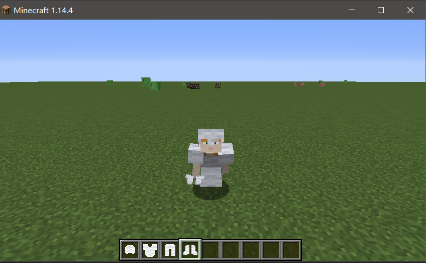
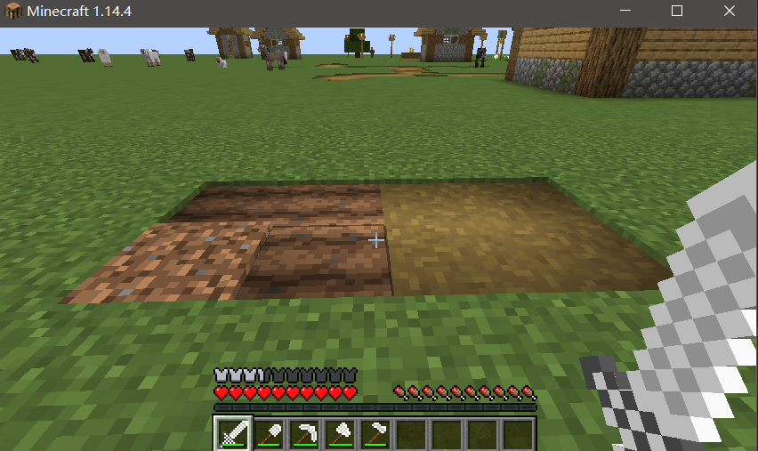

# 添加各种功能物品

## 1. 添加食物

- 食物物品的添加比较简单，在实例化物品对象时，设置Setting参数就可以注册为食物

  ~~~java
      public static final Item GREEN_APPLE_FOOD = new Item(new Item.Settings()
              .food((new FoodComponent.Builder())
                      .hunger(4)
                      .saturationModifier(0.3F)
                      .build())
              .maxCount(64));
  ~~~

- 然后像注册物品一样注册食物就可以

  ~~~java
  Registry.register(Registry.ITEM, new Identifier("demo", "green_apple_food"), GREEN_APPLE_FOOD);
  ~~~

- 添加相应的模型和翻译词条后，进入游戏测试是否添加成功。
- `FoodComponent.Builder()` 的方法：
  - `hunger(int hunger)` 设置回复饥饿值。
  - `saturationModifier(float saturationModifier)` 设置回复饱食度。
  - `meat()` 设置是否为肉食，也就是是否能给狗食用。
  - `alwaysEdible()` 设置是否能在任何时候食用，还是只能在饥饿值不满时食用。
  - `snack()` 设置是否为小吃（不了解作用，原版只有干海带有这个属性）。
  - `statusEffect(StatusEffectInstance effect, float chance)` 添加药水效果。
    - `StatusEffectInstance effect` 参数：药水效果。
    - `float chance` 获取药水效果的概率（1.0F 为100%获取）。
  - `build()` 构建食物，必须调用，必须最后调用。

## 2. 添加护甲

- 添加护甲最重要的是设置护甲的材料属性，这里新建一个类，实现`ArmorMaterial`接口 （参考原版`ArmorMaterials`类）

  - 新建一个枚举类，实现`ArmorMaterial`接口，代码如下：

    ~~~java
    public enum DemoArmorMaterial implements ArmorMaterial {
        WOOL("wool", 5, new int[]{1,3,2,1}, 15, SoundEvents.BLOCK_WOOL_PLACE, 0.0F, () -> {
            return Ingredient.ofItems(Items.WHITE_WOOL);
        });
    
        private static final int[] BASE_DURABILITY = new int[]{13, 15, 16, 11};
        private final String name;
        private final int durabilityMultiplier;
        private final int[] protectionAmounts;
        private final int enchantAbility;
        private final SoundEvent equipSound;
        private final float toughness;
        private final Lazy<Ingredient> repairIngredientSupplier;
    
        private WoolArmorMaterial(String name, int durabilityMultiplier, int[] protectionAmounts, int enchantAbility, SoundEvent equipSound, float toughness, Supplier<Ingredient> ingredientSupplier) {
            this.name = name;
            this.durabilityMultiplier = durabilityMultiplier;
            this.protectionAmounts = protectionAmounts;
            this.enchantAbility = enchantAbility;
            this.equipSound = equipSound;
            this.toughness = toughness;
            this.repairIngredientSupplier = new Lazy(ingredientSupplier);
        }
    
        @Override
        public int getDurability(EquipmentSlot slot) {
            return BASE_DURABILITY[slot.getEntitySlotId()] * this.durabilityMultiplier;
        }
    
        @Override
        public int getProtectionAmount(EquipmentSlot slot) {
            return this.protectionAmounts[slot.getEntitySlotId()];
        }
    
        @Override
        public int getEnchantability() {
            return this.enchantAbility;
        }
    
        @Override
        public SoundEvent getEquipSound() {
            return this.equipSound;
        }
    
        @Override
        public Ingredient getRepairIngredient() {
            return (Ingredient)this.repairIngredientSupplier.get();
        }
    
        @Override
        @Environment(EnvType.CLIENT)
        public String getName() {
            return this.name;
        }
    
        @Override
        public float getToughness() {
            return this.toughness;
        }
    }
    ~~~

    - 名称（`name`），稍后会用做“护甲标签”。
    - 耐久因子（`durabilityMultiplier`），基础数值乘以耐久因子即为最终耐久。
    - 护甲值（`armorValues`），或者原版代码中的“保护点数（`Protection Amounts`）” ，这是个整型数组。
    - 附魔能力（`EnchantAbility`），代表了护甲在附魔时得到高级附魔或者多个附魔的概率。
    - 声音事件（`equipSound`），用在原版护甲的声音事件是` SoundEvents.ITEM.EQUIP.ARMOR.X, X`是护甲的类型。
    - 护甲韧性（`toughness`）. 这是第二个保护值，遭受高伤害时护甲会更加坚韧，掉耐久少（译注：只有钻石护甲有这个参数）。
    - 修复材料（`repairIngredient`），这是一个 `Supplier<Ingredient>`实例而不是物品（Item）。
    - 基础耐久值（`BASE_DURABILITY`）, 这里采用原版的`{13, 15, 16, 11}`。

- 创建护甲四件套物品，添加到自定义创造标签栏中（若要添加自定义功能，可新建继承自`ArmorItem`的类）

  ~~~java
  public static final Item WOOL_HELMET = new ArmorItem(DemoArmorMaterial.WOOL, EquipmentSlot.HEAD, (new Item.Settings().group(DEMO_GROUP)));
  public static final Item WOOL_CHESTPLATE = new ArmorItem(DemoArmorMaterial.WOOL, EquipmentSlot.CHEST, (new Item.Settings().group(DEMO_GROUP)));
  public static final Item WOOL_LEGGINGS = new ArmorItem(DemoArmorMaterial.WOOL, EquipmentSlot.LEGS, (new Item.Settings().group(DEMO_GROUP)));
  public static final Item WOOL_BOOTS = new ArmorItem(DemoArmorMaterial.WOOL, EquipmentSlot.FEET, (new Item.Settings().group(DEMO_GROUP)));
  ~~~

- 注册护甲四件套物品

  ~~~java
  Registry.register(Registry.ITEM, new Identifier("demo", "wool_helmet"), WOOL_HELMET);
  Registry.register(Registry.ITEM, new Identifier("demo", "wool_chestplate"), WOOL_CHESTPLATE);
  Registry.register(Registry.ITEM, new Identifier("demo", "wool_leggings"), WOOL_LEGGINGS);
  Registry.register(Registry.ITEM, new Identifier("demo", "wool_boots"), WOOL_BOOTS);
  ~~~

- 添加材质

  - 像添加其他物品材质一样添加护甲四件套的物品材质。
  - 新建目录`\resources\assets\minecraft\textures\models\armor`
  - 在armor目录添加护甲的穿戴材质`wool_layer_1.png`和`wool_layer_2.png`，材质可参考原版材质。（`ctrl+shift+n` 查找`goldern_layer_1.png`和`goldern_layer_2.png`）

- 添加翻译词条

  ~~~json
    "item.demo.wool_helmet": "Wool Helmet",
    "item.demo.wool_chestplate": "Wool Chestplate",
    "item.demo.wool_leggings": "Wool Leggings",
    "item.demo.wool_boots": "Wool Boots",
  ~~~

  

- 运行游戏，查看效果

  

## 3. 添加工具（武器）

添加工具最重要的是设置工具的材料属性，这里新建一个类，实现`ToolMaterial`接口 （参考原版`ToolMaterials`类）

- 新建一个枚举类，实现`ToolMaterial`接口，代码如下：

  ~~~java
  public enum DemoToolMaterials implements ToolMaterial {
      WOOL(0, 30, 1.0F, 0.0F, 20, () -> {
          return Ingredient.fromTag(ItemTags.WOOL);
      });
      private final int miningLevel;
      private final int itemDurability;
      private final float miningSpeed;
      private final float attackDamage;
      private final int enchantability;
      private final Lazy<Ingredient> repairIngredient;
  
      private DemoToolMaterials(int miningLevel, int itemDurability, float miningSpeed, float attackDamage, int enchantibility, Supplier<Ingredient> repairIngredient) {
          this.miningLevel = miningLevel;
          this.itemDurability = itemDurability;
          this.miningSpeed = miningSpeed;
          this.attackDamage = attackDamage;
          this.enchantability = enchantibility;
          this.repairIngredient = new Lazy(repairIngredient);
      }
  
      @Override
      public int getDurability() {
          return this.itemDurability;
      }
  
      @Override
      public float getMiningSpeed() {
          return this.miningSpeed;
      }
  
      @Override
      public float getAttackDamage() {
          return this.attackDamage;
      }
  
      @Override
      public int getMiningLevel() {
          return this.miningLevel;
      }
  
      @Override
      public int getEnchantability() {
          return this.enchantability;
      }
  
      @Override
      public Ingredient getRepairIngredient() {
          return (Ingredient) this.repairIngredient.get();
      }
  }
  ~~~

  - `miningLevel` ：挖掘等级
  - `itemDurability`：工具耐久
  - `miningSpeed`：挖掘速度
  - `attackDamage`：攻击伤害
  - `enchantability`：附魔能力
  - `repairIngredient`：修复材料

- 创建工具（以斧头为例，其他工具和武器类似）

  - 由于`AxeItem`类的构造函数是`protected`修饰的，不能在包外实例化，所以新建一个类，继承自`AxeItem`类，同样的还有`PackaxeItem`类。

    ~~~java
    public class WoolAxeItem extends AxeItem {
        public WoolAxeItem(Settings settings) {
            super(DemoToolMaterials.WOOL, 6.0F, -3.2F, settings);
        }
    }
    ~~~

    - `AxeItem` 第二个参数为攻击伤害，工具总伤害还要加上材料基础伤害
    - `AxeItem` 第三个参数为攻击速度

  - 实例化对象

    ~~~java
    public static final Item WOOL_AXE = new WoolAxeItem((new Item.Settings().group(DEMO_GROUP)));
    ~~~

  - 注册物品对象

    ~~~java
    Registry.register(Registry.ITEM, new Identifier("demo", "wool_axe"), WOOL_AXE);
    ~~~

- 添加材质

  ~~~json
  {
    "parent": "item/handheld", //手持工具样式
    "textures": {
      "layer0": "demo:item/wool_axe"
    }
  }
  ~~~

- 添加翻译词条

  ~~~json
    "item.demo.wool_sword": "Wool Sword",
    "item.demo.wool_axe": "Wool Axe",
    "item.demo.wool_pickaxe": "Wool Pickaxe",
    "item.demo.wool_shovel": "Wool Shovel",
    "item.demo.wool_hoe": "Wool Hoe",
  ~~~

- 运行游戏，查看效果

  