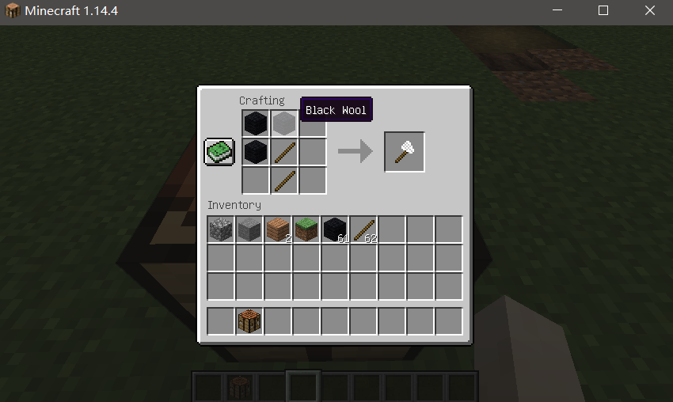

# 添加物品合成表

## **添加基础的合成（其实跟原版合成一样）**

- 新建目录`resources/data/tutorial/recipes`

- 在目录下新建名为物品ID的`json`文件(以羊毛斧为例)，添加如下代码

  ~~~
  {
    "type": "minecraft:crafting_shaped",
    "pattern": [
      "XX",
      "X#",
      " #"
    ],
    "key": {
      "#": {
        "item": "minecraft:stick"
      },
      "X": {
        "tag": "minecraft:wool"
      }
    },
    "result": {
      "item": "demo:wool_axe",
      "count":1
    }
  }
  ~~~

  - **`type`**: 代表一个有序工作台合成。
  - **`result`**: 这个合成的产物是1个`demo:wool_axe`物品，count字段则是可选的，如果没有指定count，默认则是1.
  - **`pattern`**: 一个“模板”代表了合成表的形式，每个字母代表了一个物品，空白区域代表那个格子没有物品，至于字母代表的物品是什么，在**key**中定义。
  - **`key`**:`pattern`中的字母代表的物品，在这里X代表了任何具有`minecraft:wool`标签(tag)的物品（所有的羊毛），X则代表了木棍这个物品(item)。

- 运行游戏，查看效果

  ​	

## 添加自定义的合成（待续。。。）

