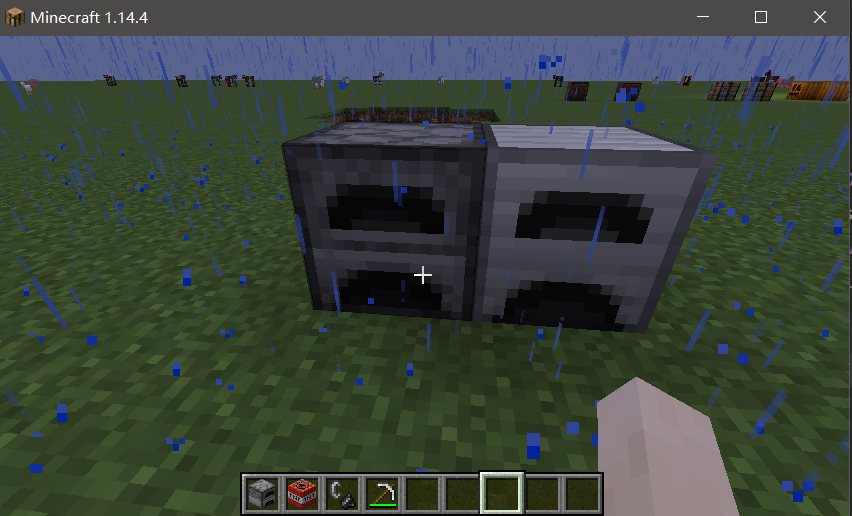

# 第一个方块

- 创建方块

  ~~~java
  public static final Block IRON_FURNACE_BLOCK = new Block(FabricBlockSettings.of(Material.METAL).build());
  ~~~

- 注册方块和方块物品

  ~~~java
  Registry.register(Registry.BLOCK, new Identifier("demo", "iron_furnace_block"), IRON_FURNACE_BLOCK);
  Registry.register(Registry.ITEM, new Identifier("demo", "iron_furnace_block"), new BlockItem(IRON_FURNACE_BLOCK, new Item.Settings().group(DEMO_GROUP)));
  ~~~

- 添加材质（参考原版熔炉实现）

  ~~~
  Blockstate: src/main/resources/assets/demo/blockstates/iron_furnace_block.json
  Block Model: src/main/resources/assets/demo/models/block/iron_furnace_block.json
  Item Model: src/main/resources/assets/demo/models/item/iron_furnace_block.json
  Block Texture: src/main/resources/assets/demo/textures/block/iron_furnace_block.png
  ~~~

  ~~~json
  //Blockstate
  {
      "variants": {
          "facing=north,lit=false": { "model": "demo:block/iron_furnace_block" },
          "facing=south,lit=false": { "model": "demo:block/iron_furnace_block", "y": 180 },
          "facing=west,lit=false":  { "model": "demo:block/iron_furnace_block", "y": 270 },
          "facing=east,lit=false":  { "model": "demo:block/iron_furnace_block", "y": 90 },
          "facing=north,lit=true": { "model": "demo:block/iron_furnace_block_on" },
          "facing=south,lit=true": { "model": "demo:block/iron_furnace_block_on", "y": 180 },
          "facing=west,lit=true":  { "model": "demo:block/iron_furnace_block_on", "y": 270 },
          "facing=east,lit=true":  { "model": "demo:block/iron_furnace_block_on", "y": 90 }
      }
  }
  ~~~

  ~~~json
  //Block Model
  {
      "parent": "block/orientable",
      "textures": {
          "top": "demo:block/iron_furnace_block_top",
          "front": "demo:block/iron_furnace_block_front",
          "side": "demo:block/iron_furnace_block_side"
      }
  }
  ~~~

  ~~~json
  //Item Model
  {
    "parent": "demo:block/iron_furnace_block"
  }
  ~~~

- 添加合成表

  ~~~json
  {
    "type": "minecraft:crafting_shaped",
    "pattern": [
      "###",
      "# #",
      "###"
    ],
    "key": {
      "#": {
        "item": "minecraft:iron_ingot"
      }
    },
    "result": {
      "item": "demo:iron_furnace_block"
    }
  }
  ~~~

  

- 添加战利品表

  - 破坏方块时的掉落物

  - `src/main/resources/data/damo/loot_tables/blocks/iron_furnace_block.json`

    ~~~json
    "type": "minecraft:block",
      "pools": [
        {
          "rolls": 1,
          "entries": [
            {
              "type": "minecraft:item",
              "name": "demo:iron_furnace_block"
            }
          ],
          "conditions": [
            {
              "condition": "minecraft:survives_explosion"
            }
          ]
        }
      ]
    }
    ~~~

- 运行游戏，发现物品栏显示正常，但放置后材质丢失，因为没有设置方块状态

- 添加方块状态

  - 新建类，继承自Block类

    ~~~java
    public class IronFurnaceBlock extends Block {
        public IronFurnaceBlock(Settings settings) {
            super(settings);
        }
    }
    ~~~

  - 方块创建修改为自定义方块类

    ~~~java
    public static final Block IRON_FURNACE_BLOCK = new IronFurnaceBlock(FabricBlockSettings.of(Material.METAL).build());
    ~~~

    

  - 添加方块状态

    ~~~java
    public static final DirectionProperty FACING;
    public static final BooleanProperty LIT;
    
    @Override
    protected void appendProperties(StateFactory.Builder<Block, BlockState> builder) {
        builder.add(FACING, LIT);
    }
    
    static {
        FACING = HorizontalFacingBlock.FACING;
        LIT = RedstoneTorchBlock.LIT;
    }
    ~~~

  - 重写获取物品放置时的状态方法

    ~~~java
    @Override
    public BlockState getPlacementState(ItemPlacementContext ctx) {
    return this.getDefaultState().with(FACING,ctx.getPlayerFacing().getOpposite());
    }
    ~~~

- 运行游戏，查看效果

  

