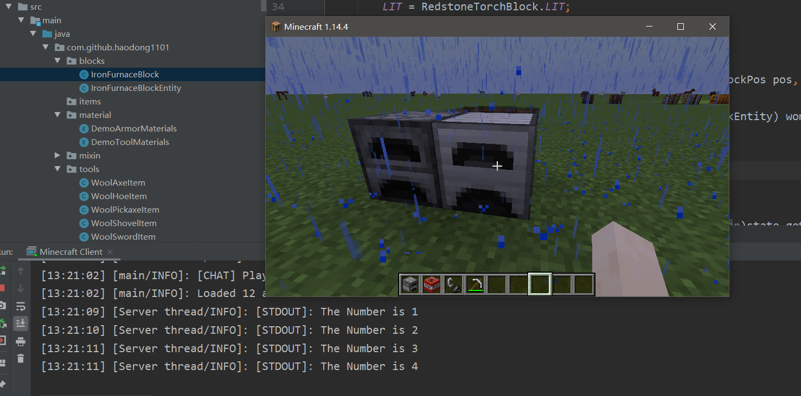
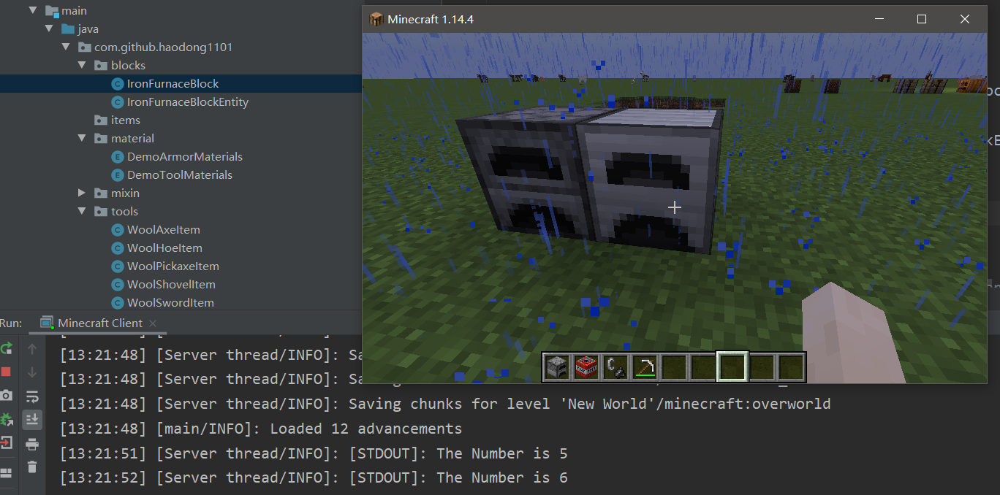

# 方块实体

- 上一章节简单了解了方块的状态。启动游戏时，一个方块所有可能的状态都会被注册，这就意味着如果你有14个布尔属性，这个方块就有2^14=16384个状态被注册，因为这个原因，方块不应该有太多的方块状态属性。准确来说，方块状态是用来看的，`BlockEntity`（方块实体）才是用于更高级状态的。

- `BlockEntity`（方块实体）主要用于向方块存储数据，因此在创建方块实体之前，得先有个方块，这一章节讲`BlockEntity`的创建和注册。

- 创建和注册

  - 创建方块实体类，继承自`BlockEntity` （这里会提示有错误，先不用管）

    ~~~java
    public class IronFurnaceBlockEntity extends BlockEntity {
    
        public IronFurnaceBlockEntity() {
        }
    }
    ~~~

  - 注册方块实体（这里也会提示有错误，先不管）

    ~~~java
    //声明
    public static BlockEntityType<IronFurnaceBlockEntity> IRON_FURNACE_BLOCK_ENTITY;
    
    
    //注册， 在onInitialize()方法中
    IRON_FURNACE_BLOCK_ENTITY = Registry.register(Registry.BLOCK_ENTITY, "demo:iron_furnace", BlockEntityType.Builder.create(IronFurnaceBlockEntity::new, IRON_FURNACE_BLOCK).build(null));
    ~~~

  - 修改方块实体类构造方法

    ~~~java
    public IronFurnaceBlockEntity() {
        super(DemoMod.INSTANCE.IRON_FURNACE_BLOCK_ENTITY);
    }
    
    //这里传入了DemoMod类的实例，下面是实现:
    public class DemoMod implements ModInitializer {
        public static DemoMod INSTANCE;
        public DemoMod(){INSTANCE = this;}
        [...]
    }
    ~~~

  - 在你的Block类中实现`BlockEntityProvider`接口

    ~~~java
    public class IronFurnaceBlock extends Block implements BlockEntityProvider {
        [...]
        @Override
        public BlockEntity createBlockEntity(BlockView view) {
            return new IronFurnaceBlockEntity();
        }
    }
    ~~~

  - 现在，方块实体就已经可以使用了，但是还没有任何功能。

- 序列化数据

  - 重写`toTag`和`fromTag`方法,这里新建了一个变量和方法用来测试。

    ~~~java
    private int num = 0;
    @Override
    public CompoundTag toTag(CompoundTag compoundTag) {
        super.toTag(compoundTag);
        compoundTag.putInt("num",num);
        return compoundTag;
    }
    
    @Override
    public void fromTag(CompoundTag compoundTag) {
        super.fromTag(compoundTag);
        num = compoundTag.getInt("num");
    }
    public void numAdd(){ //调用函数，变量+1，并打印
        num++;
        System.out.println("The Number is "+ num);
    }
    ~~~

  - 在`IronFurnaceBlock`类中重写`activate`方法，实现右键方块功能

    ~~~java
    @Override
    public boolean activate(BlockState state, World world, BlockPos pos, PlayerEntity player, Hand hand, BlockHitResult hit) {
        if (world.isClient)return true; 
        //获取方块实体
        IronFurnaceBlockEntity blockEntity = (IronFurnaceBlockEntity) world.getBlockEntity(pos);
        //数字加1
        blockEntity.numAdd();
        return true;
    }
    ~~~

  - 运行游戏，验证实现

    

    重新进入世界后，数据也能正常读取保存

    