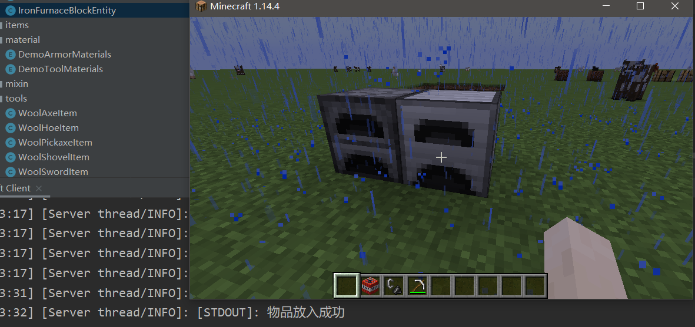
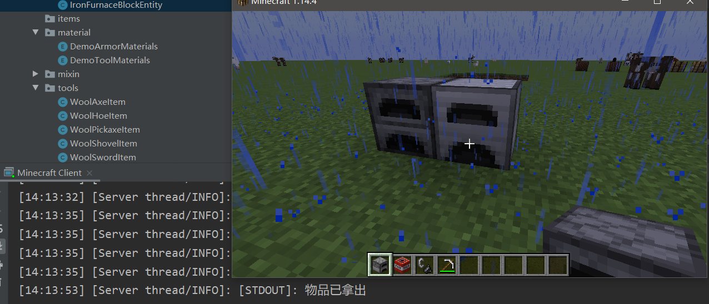

# 物品存储实现

- 上一章学习了方块实体的实现，但并没有添加功能，这一章学习为方块添加存储物品的功能。

- 方块实体类实现`Inventory`接口

  ~~~java
  public class IronFurnaceBlockEntity extends BlockEntity implements Inventory {
      private DefaultedList<ItemStack> inventory;  //新建物品存储区
  
      public IronFurnaceBlockEntity() {
          super(DemoMod.IRON_FURNACE_BLOCK_ENTITY);
          this.inventory = DefaultedList.ofSize(3, ItemStack.EMPTY); //初始化物品存储区，能存三种物品，且全为空
      }
  
      @Override
      public CompoundTag toTag(CompoundTag compoundTag) {
          super.toTag(compoundTag);
          Inventories.toTag(compoundTag, this.inventory); //保存物品存储区数据
          return compoundTag;
      }
  
      @Override
      public void fromTag(CompoundTag compoundTag) {
          super.fromTag(compoundTag);
          this.inventory = DefaultedList.ofSize(this.getInvSize(), ItemStack.EMPTY);
          Inventories.fromTag(compoundTag, this.inventory);//获取物品存储区数据
      }
  
      @Override
      public int getInvSize() {  //获取物品存储区的大小（能存储几种物品）
          return this.inventory.size();
      }
  
      @Override
      public boolean isInvEmpty() {//判断物品存储区是否为空
          Iterator var1 = this.inventory.iterator();
  
          ItemStack itemStack;
          do {
              if (!var1.hasNext()) {
                  return true;
              }
  
              itemStack = (ItemStack) var1.next();
          } while (itemStack.isEmpty());
  
          return false;
      }
  
      @Override
      public ItemStack getInvStack(int slot) {//获取物品存储区指定格子的物品（全部数量）
          return this.inventory.get(slot);
      }
  
      @Override
      public ItemStack takeInvStack(int slot, int amount) {//从格子里取出“一堆”物品（ItemStack），如果格子里的物品数量比你要取出的物品数量少，就取出所有物品
          return Inventories.splitStack(this.inventory, slot, amount);
      }
  
      @Override
      public ItemStack removeInvStack(int slot) {//移除指定格子的物品，并返回
          return Inventories.removeStack(this.inventory, slot);
      }
  
      @Override
      public void setInvStack(int slot, ItemStack stack) {//用你提供的ItemStack替换格子里的
          this.inventory.set(slot, stack);
          if (stack.getCount() > this.getInvMaxStackAmount()) {
              stack.setCount(this.getInvMaxStackAmount());
          }
      }
  
      @Override
      public boolean canPlayerUseInv(PlayerEntity player) {//如果你想在保存时做些什么就重写这个
          if (this.world.getBlockEntity(this.pos) != this) {
              return false;
          } else {
              return player.squaredDistanceTo((double) this.pos.getX() + 0.5D, (double) this.pos.getY() + 0.5D, (double) this.pos.getZ() + 0.5D) <= 64.0D;
          }
      }
  
      @Override
      public void clear() {//清空物品存储区
          this.inventory.clear();
      }
  }
  ~~~

- 为了验证是否实现，重写`IronFurnaceBlock`类的`activate`方法

  ~~~java
  //如果玩家手上有物品，并且方块物品存储区第一个格子没有物品，就将物品放入
  //如果玩家手上没有物品，并且方块物品存储区第一个格子有物品，就将物品取出
  @Override
  public boolean activate(BlockState state, World world, BlockPos pos, PlayerEntity player, Hand hand, BlockHitResult hit) {
      if (world.isClient)return true;
      IronFurnaceBlockEntity blockEntity = (IronFurnaceBlockEntity) world.getBlockEntity(pos);
      if (!player.getStackInHand(hand).isEmpty()){
          if (blockEntity.getInvStack(0).isEmpty()){
              blockEntity.setInvStack(0,player.getStackInHand(hand).copy());
              player.getStackInHand(hand).setCount(0);
              System.out.println("物品放入成功");
          }
      }
      else{
          if (!blockEntity.getInvStack(0).isEmpty()){
              player.inventory.offerOrDrop(world, blockEntity.getInvStack(0));
              blockEntity.removeInvStack(0);
              System.out.println("物品已拿出");
          }
      }
      return true;
  }
  ~~~

- 运行游戏，验证实现

  
  
  

- 如果你想基于（方块的）每一个面，有不同的交互逻辑（比如漏斗或者其他mod），需要实现`SidedInventory`接口

  ~~~java
  public class IronFurnaceBlockEntity extends BlockEntity implements Inventory, SidedInventory {
  	[...]
      @Override
      public int[] getInvAvailableSlots(Direction side) {
          int[] result = new int[this.inventory.size()];
          for (int i = 0; i < result.length; i++) {
              result[i] = i;
          }
          return result;
      }
  
      //设置能从什么方向(面)放入物品
      @Override
      public boolean canInsertInvStack(int slot, ItemStack stack, Direction dir) {
          return dir != Direction.UP;
      }
  	
      //设置能从什么方向(面)取出物品
      @Override
      public boolean canExtractInvStack(int slot, ItemStack stack, Direction dir) {
          return true;
      }
  }
  ~~~

  

